# Microsonya 0.2 — Architecture Mental Model

## How to read this document

Проверка структуры и ownership `packages/summarize`: 2026-09-08, baseline `f0d26cf707b19d8a8e8c6c0df9c062b049fe64e0` плюс текущий dirty working tree этого рефакторинга. Проверены новый module graph, selection, model prompts и per-attempt evidence; эта запись не обновляет baseline остальных подсистем. Удаление runtime `Object.freeze` из `b83a23e` сохранено: readonly TypeScript-контракты не означают runtime freeze.

Последняя проверка summary window/cache/checkpoint boundaries: 2026-09-07, baseline `4cbea1921b036a3c6e18a452337b7bb601d20571` плюс текущие незакоммиченные изменения. Telegram ingress parsing boundary проверена 2026-09-08 на `b83a23e890930b10620b624aa0c1843f1cca6d4a` плюс текущие незакоммиченные изменения. В текущем dirty tree дополнительно проверены exact snapshot reuse, historical read-only semantics, Processor → repository wiring и единая Telegram message/command projection; остальные workflow, ledger и lifecycle сохраняют предыдущие проверки 2026-09-05/07.

Это причинная модель **текущего рабочего дерева**. На 2026-09-07 дерево dirty: помимо описанного здесь ingress observability refactor присутствуют несвязанные незакоммиченные изменения WMA и repository guidance. Обозначение «0.2» взято из задания: корневой `package.json` пока содержит `0.1.1`, а часть пакетов и комментариев — `0.1`. Это карта исходников, а не подтверждение версии, развёрнутой в Cloudflare.

Первые разделы позволяют провести команду через систему. Разделы про окно, checkpoint и recovery объясняют, что произойдёт при следующей команде или сбое. Invariants, карточки и примеры дают точки для проверки понимания.

Немаркированные утверждения — **FACT**, установленные по реализации; короткие ссылки рядом указывают место проверки. **INFERENCE** означает явно обозначенный вывод из взаимодействия компонентов, а не гарантию теста. Неподтверждённые deployment/product semantics собраны как **UNKNOWN / requires clarification**. Гипотезы не используются для заполнения основной карты.

Канонический словарь TypeScript: **SummaryCommand** — пользовательский запрос; **SummaryExecution** — mutable operational execution в `summary_run_lifecycle`; **SummaryAttempt** — immutable evidence одной processing-попытки в физической таблице `summary_runs`; **AcceptedOutcome** — полностью восстанавливаемый semantic result; **SelectedConversation** — eligible + context для попытки; **consumption boundary** — вычисляемая граница обработанной eligible-истории; **delivery payload** — сохранённый в lifecycle текст для recovery доставки. Имена физических таблиц пока исторические и намеренно не менялись.

Канонические имена контрактов — `AcceptedOutcomeRecord`, `SummaryAttempt`, `SummaryExecution`, `SummaryAttemptRepository`, `SummaryExecutionRepository` и `MessageHistoryRepository`. Старые migration aliases удалены. **Checkpoint** в старых именах schema и prose означает consumption boundary, а не статус доставки и не отдельную cursor row.

## System in 60 seconds

Microsonya принимает Telegram updates и сохраняет текст обычных сообщений в PostgreSQL. Slash-команды исключаются из этой истории. `/summary` создаёт один durable run по идентичности команды; Queue переносит только его `runId`.

Ingress также является Queue consumer: он вызывает Processor через Service Binding. Processor получает у Lifecycle lease, читает историю и последний canonical checkpoint, выбирает окно, затем получает от classifier решение. `SUMMARIZE` вызывает генерацию; `DEFER_*` оставляет материал на будущее; `SKIP_*` намеренно пропускает материал.

Одна транзакция `recordAttempt` сохраняет результат, точные snapshots входа и сопутствующие evidence. Только catch-up intent `recent` (голая `/summary`) разрешает сохранённому `summarized` или `skipped` attempt стать основанием checkpoint. Исторические `today` и `count` сохраняют результат для чтения, но checkpoint не меняют.

Затем Processor отдельно сохраняет текст доставки в lifecycle, получает delivery lease, завершает Telegram delivery и только после неё записывает `completed`. Preview может быть виден в Telegram ещё во время генерации. Cron восстанавливает зависшие runs из БД. Повторный запуск переиспользует уже сохранённый outcome; атомарности между PostgreSQL и Telegram нет.

## System context

## Реализованные границы модулей (dirty tree 2026-09-07)

`packages/summarize` организован по тому же принципу, что Telegram adapters: root-файлы `summary.*` обозначают основные операции, специализированные модули и отдельные классы находятся в `window`, `classifier`, `generation`, `model`, `execution`, `progressive`. `summary.window.ts` единолично строит `SelectedConversation` и consumption upper bound; `summary.evaluation.ts` классифицирует и при необходимости вызывает модель; `summary.outcome.ts` превращает terminal disposition в полный `AcceptedOutcomeRecord`; `summary.presentation.ts` владеет пользовательским текстом. `createSummaryWorkflow()` в `summary.workflow.ts` остаётся единственной публичной фабрикой workflow. `execution/attempt.ts` управляет порядком операций, `SummaryAttemptRecorder` связывает per-attempt evidence с портом persistence, а `buildAttemptRecord()` остаётся чистой функцией. Обязательный `SummaryExecutionJournal` независимо собирает execution evidence; нейтральные события и optional observer вынесены в `execution/events.ts` и `execution/observer.ts`. Общий PIPECHAT transcript находится в `model/transcript.ts`; schemas, prompt policy и model calls разделены физически без изменения prompt bytes и policy identity.

DB repositories разделены по durable responsibility в `packages/db/src/repositories`: message history, summary attempt/transaction coordinator, summary execution lifecycle, consumption-boundary query, dataset candidate и WMA catalog projection. `SummaryAttemptRepository.recordAttempt()` остаётся одной транзакцией: helper-файлы разделяют SQL/ownership, но не атомарность fencing, attempt, snapshots, model evidence, dataset candidate и WMA projection.

Cloudflare Ingress `worker.ts` только маршрутизирует HTTP и Queue. Webhook verification/parsing orchestration, message persistence, durable summary-command acceptance и Queue consumption находятся в отдельных adapter-файлах. Processor `worker.ts` является только Service Binding entrypoint; processing coordination, accepted-outcome recovery, lease heartbeat, failure policy, Telegram delivery transport и payload validation физически разделены. Это ownership decomposition, а не новые distributed services.

**Вопрос схемы 1: где находятся транспортные и durable boundaries?** Lifecycle и Processor — отдельные Workers с RPC entrypoints; PostgreSQL — общая БД через Hyperdrive. Durable Objects в этом пути нет.

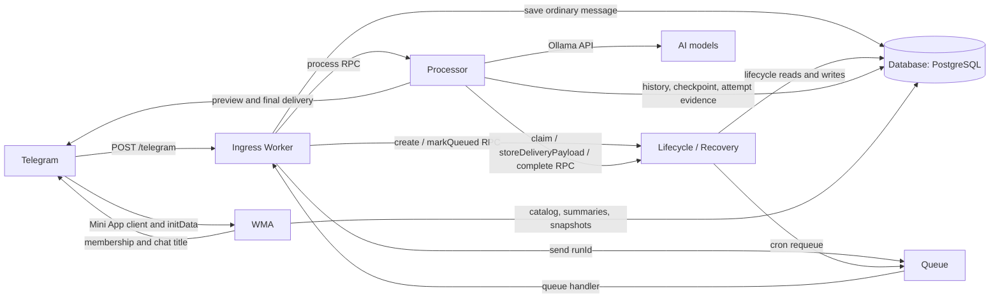

Worker names/bindings и Queue consumer заданы в [ingress config](../../apps/cloudflare/workers/ingress/wrangler.jsonc), [lifecycle config](../../apps/cloudflare/workers/lifecycle/wrangler.jsonc), [processor config](../../apps/cloudflare/workers/processor/wrangler.jsonc). Значения этих файлов — конфигурация репозитория, не доказательство deployment. [worker-db.ts](../../apps/cloudflare/src/runtime/worker-db.ts) — `withWorkerDatabase()` открывает request-scoped client и закрывает его в `finally`; это lifetime соединения, не общая транзакция запроса.

## End-to-end summary pipeline

**Вопрос схемы 2: какие durable шаги отделяют update от завершённой команды?** «Message save» — ветка обычного update; сама `/summary` через неё проходит без записи. Для `/app` существует более ранний выход с launcher message.

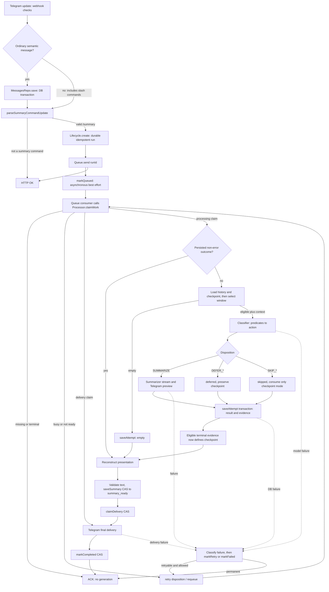

Ребро `markQueued → claimWork` отражает нормальное состояние перед claim, а не синхронное ожидание: Queue может вызвать Processor раньше фонового `markQueued`. `created` ещё не claimable; Processor вернёт `pending`, а consumer перепубликует job. При утрате queued marker поможет cron.

Проверки webhook: путь `/telegram`, метод POST, secret header. Общий Telegram boundary decoder берёт только `update.message`, допускает `message_id = 0` для ephemeral update, извлекает text/caption, destination date, reply ID, первый валидный `bot_command` с offset 0 и author provenance с приоритетом `sender_chat`. Он не обрабатывает `edited_message`/`channel_post`. Общий command parser проверяет forward provenance и нормализованный bot target; доменные adapters отдельно исключают slash-команды из истории, требуют persistent `message_id > 0` для `ChatMessage` и текущего `/summary`, а `/app` применяет private/ephemeral policy. Аргументы `/summary`: пусто → `recent`, `today` → `today`, целое `1..128` → `count`.

Idempotency key — `telegram:<chatId>:<commandMessageId>`, а не Telegram `update_id`. HTTP OK для summary возвращается после `create` и успешного `Queue.send`; `markQueued` выполняется через `waitUntil`. Транзакции message save и run creation используют общий advisory lock по chat, но выполняются отдельно. Этот lock сериализует начавшиеся короткие записи, не гарантирует, что все более ранние Telegram сообщения уже пришли.

Evidence: [telegram-webhook-handler.ts](../../apps/cloudflare/src/ingress/telegram-webhook-handler.ts) — `handleTelegramWebhook()`; [telegram.message.ts](../../packages/telegram/src/telegram.message.ts) — `parseTelegramMessageUpdate()`; [telegram.command.ts](../../packages/telegram/src/telegram.command.ts) — `parseTelegramCommand()`; [chatMessage.ts](../../packages/telegram/src/chatMessage.ts) — `parseTelegramChatMessageUpdate()`; [summaryCommand.ts](../../packages/telegram/src/summaryCommand.ts) — `parseSummaryCommandUpdate()`/`parseSummaryArgs()`; [summary-queue-consumer.ts](../../apps/cloudflare/src/ingress/summary-queue-consumer.ts) — `processSummaryMessage()`.

## Successful summary sequence

**Вопрос: что записано к моменту, когда пользователь видит финальный текст?** Ниже обычный `recent`, classifier выбрал `SUMMARIZE`, lease не утрачен. Delivery — роль внутри Processor и Telegram adapter, не отдельный Worker.

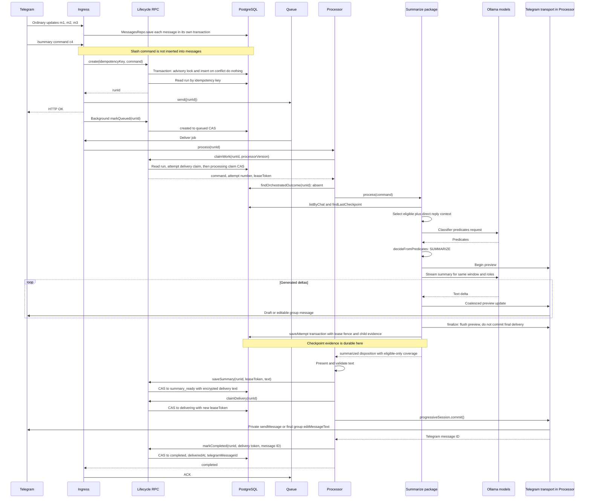

На обычном streaming пути группа получает редактируемое сообщение с ` ▍` до persistence, а финальный commit убирает маркер. Stream chunks собираются без переписывания уже опубликованного префикса; после последнего chunk итоговый content и доступные usage fields записываются в execution journal как model-response envelope. В личном чате preview использует `sendMessageDraft`, commit — `sendMessage`. После recovery process-local session отсутствует: Processor использует обычный `sendTelegramMessage()` с сохранённым текстом. Во время вычисления отдельный timer продлевает processing lease; для delivery аналогичного heartbeat в Processor нет.

Evidence: [processor/worker.ts](../../apps/cloudflare/src/processor/worker.ts) — `processRun()`, `withProcessingLeaseHeartbeat()`, `deliverInsideSpan()`; [ProgressiveSummarySession.ts](../../packages/summarize/src/progressive/ProgressiveSummarySession.ts) — `finalize()`/`commit()`; [progressiveTransport.ts](../../packages/telegram/src/progressiveTransport.ts).

## Ownership model

**Вопрос схемы 3: куда смотреть первым, если меняется конкретная семантика?** Стрелки обозначают ownership, а не порядок вызовов.

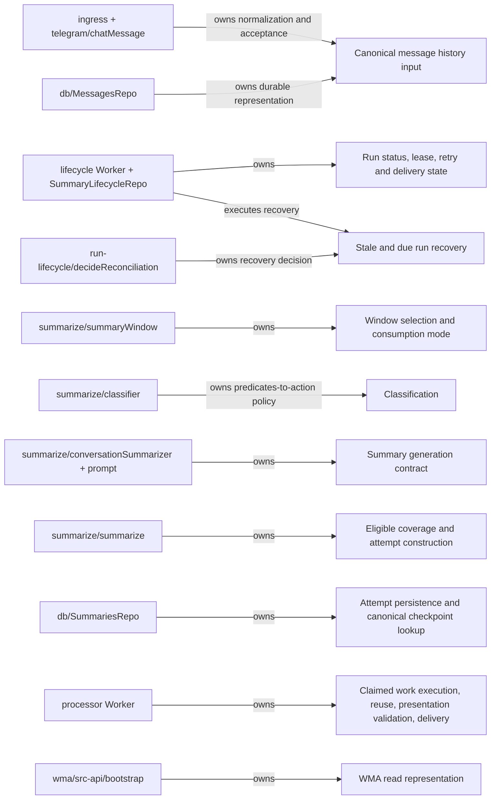

Lifecycle не решает, какие сообщения потреблять. `packages/summarize` не владеет distributed lease или Queue ACK. Processor связывает эти два контракта: его adapter под именем `findLastRun` вызывает именно `SummariesRepo.findLastCheckpoint`, а `saveAttempt` добавляет orchestration ID, номер попытки и lease token. `SummariesRepo` является важным пересечением границ: он сохраняет semantic evidence и внутри той же транзакции проверяет operational ownership через lifecycle row.

## Durable state

**Вопрос схемы 4: что переживает restart и что можно восстановить из чего?** Сплошные связи ниже — durable references либо источник derived representation; пунктир — временное вычисление. `summary_runs.orchestration_run_id` логически связывает attempt с lifecycle, но schema не объявляет для него foreign key.

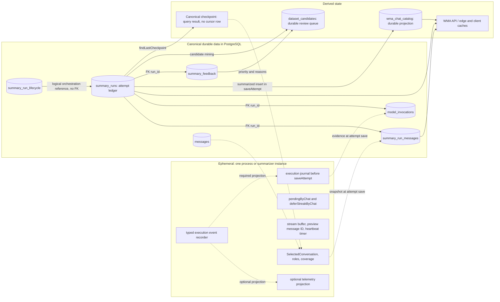

| Entity                  | Что означает                                                                                                       | Кто создаёт / изменяет                                                                                    | Кто читает                                                              |
| ----------------------- | ------------------------------------------------------------------------------------------------------------------ | --------------------------------------------------------------------------------------------------------- | ----------------------------------------------------------------------- |
| `messages`              | Последняя сохранённая нормализованная версия сообщения по `(chat_id, message_id)`                                  | Ingress → `MessagesRepo.save`, upsert в транзакции                                                        | Summarizer через `listByChat`; другие методы repo для range/find        |
| `summary_run_lifecycle` | Команда, mutable status, processing/delivery counters, lease, retry schedule, текст доставки и receipt             | Lifecycle RPC/reconciler → `SummaryLifecycleRepo`; также `saveAttempt` обновляет `updated_at` при fencing | Processor через RPC; reconciler/health; `saveAttempt` guard             |
| `summary_runs`          | Результат attempt: status/action, mode, границы eligible, checkpoint evidence, encrypted summary, timings/hashes   | `SummariesRepo.saveAttempt`; legacy `saveRun`; исторические migrations                                    | Checkpoint lookup, outcome reuse, WMA                                   |
| `summary_run_messages`  | Неизменяемый на active insert path snapshot всего model window с порядком и `eligible/context`                     | `saveAttempt` вместе с parent attempt                                                                     | WMA detail; evidence inspection/tests                                   |
| `model_invocations`     | Evidence вызовов моделей: profile, prompt hash, результат/predicates, latency, error                               | `saveAttempt` из execution journal, независимо от telemetry                                               | Evidence inspection/tests; основная processing policy обратно не читает |
| `wma_chat_catalog`      | Агрегат по отображаемым summarized attempts: число summary, сумма message count, последняя дата, encrypted chat ID | `saveAttempt` только для нового `summarized`; migrations 0013–0016                                        | WMA home и overview                                                     |
| `summary_feedback`      | Отдельный feedback, включая corrected text; не замена canonical summary                                            | `SummaryFeedbackRepo.save`; вызов из live Worker endpoints не найден                                      | Evidence/review consumers; основной runtime не читает                   |
| `dataset_candidates`    | Производная очередь кандидатов для review, причины и приоритет                                                     | `saveAttempt` и `SummaryFeedbackRepo.save`                                                                | Review/evidence consumers; WMA summary flow не читает                   |

`messages` mutable, тогда как snapshots сохраняют вход конкретного attempt даже после последующего upsert исходного сообщения. «Immutable ledger» описывает активный insert-on-conflict-do-nothing путь: DB не запрещает произвольный UPDATE, migrations обновляли старые rows, а legacy `saveRun` содержит update branch.

Тексты, имена и восстанавливаемый Telegram chat ID зашифрованы AES-256-GCM. Поисковые chat/author/idempotency ключи — namespaced HMAC. Lease tokens, message IDs, статусы и счётчики нужны для operational queries; не вся строка зашифрована целиком. `MessagesRepo` возвращает author ID как stored lookup key, а имя расшифровывает; prompt затем присваивает window-local aliases.

Queue message — durable transport identity, не копия команды, окна или результата. Analytics Engine получает observability; его записи не являются источником checkpoint/retry correctness. WMA caches — заменяемое derived state, даже если cache entry пережил конкретный request.

В production Processor создаёт новый `Summarizer` внутри каждого processing claim и вызывает у него `process()` один раз. Поэтому `pendingByChat` и `deferStreakByChat` не разделяются между командами или retries этого runtime path; их многовызовное поведение проявляется при переиспользовании одного facade, например в tests. Distributed exclusion обеспечивает lifecycle repository.

Evidence: [schema.ts](../../packages/db/src/schema.ts); [messages.repo.ts](../../packages/db/src/repos/messages.repo.ts); [summaries.repo.ts](../../packages/db/src/repos/summaries.repo.ts); [feedback.repo.ts](../../packages/db/src/repos/feedback.repo.ts); [encryption.ts](../../packages/db/src/encryption.ts); [summary-ledger.test.ts](../../test/summary-ledger.test.ts).

## Source of truth map

| Concept                    | Source of truth                                                                                    | Derived from                                                                               | Writers                                                          | Readers                                                |
| -------------------------- | -------------------------------------------------------------------------------------------------- | ------------------------------------------------------------------------------------------ | ---------------------------------------------------------------- | ------------------------------------------------------ |
| Messages                   | `messages` для доступной сохранённой истории; `summary_run_messages` для входа конкретного attempt | Telegram normalization; snapshot selection                                                 | Ingress/`MessagesRepo`; `saveAttempt`                            | Summarizer; WMA snapshots                              |
| Summary run status         | `summary_run_lifecycle.status`                                                                     | CAS transitions и claims                                                                   | `SummaryLifecycleRepo`                                           | `claimWork`, reconciliation, health                    |
| Summary result             | `summary_runs.summary_text_ciphertext`, status/action и snapshots                                  | Classifier/disposition/generation                                                          | `saveAttempt`                                                    | Outcome reuse, WMA                                     |
| Checkpoint                 | Результат `findLastCheckpoint(chatId)`                                                             | Последний по command ordering `recent` + `summarized/skipped` attempt, его `to_message_id` | Отдельного writer нет; qualifying attempt меняет результат query | Adapter Processor → `createSummarizer`                 |
| Window                     | Во время вычисления `SelectedConversation`; после записи — snapshot rows как evidence того входа   | History + command boundaries + checkpoint + direct parents                                 | `selectSummaryWindow`, затем `saveAttempt`                       | Classifier/summarizer; WMA detail                      |
| Delivery state             | Lifecycle status, summary ciphertext, `delivery_attempt`, `delivered_at`, `telegram_message_id`    | Presentation результата и подтверждение Telegram                                           | `saveSummary`, claims, `markCompleted`, retry/failure methods    | Processor, reconciliation                              |
| WMA summary representation | Ledger summary + ledger snapshots; каталог для агрегатов                                           | Только displayable `summarized`, включая count; без проверки lifecycle completed           | Projection в `saveAttempt`, API mapping, caches                  | WMA UI                                                 |
| Retry schedule             | `retry_stage`, `next_retry_at`, lease expiry в lifecycle                                           | Error policy или lease recovery                                                            | Processor через RPC; reconciler                                  | Claims и cron; Queue delay лишь транспортная подсказка |

У checkpoint есть два похожих представления: `checkpoint_after` записан как evidence решения attempt, но **SQL reader не берёт `max(checkpoint_after)`**. Он фильтрует mode/status и возвращает eligible range последней подходящей строки. Поэтому проверять только `checkpoint_after` недостаточно для изменения consumption semantics.

## Summary run lifecycle

**Вопрос схемы 8: какие реальные статусы разрешают работу после retry?** На схеме только восемь строковых значений из schema. У retry сохраняется stage `processing` либо `delivery`; он определяет смысл queued.

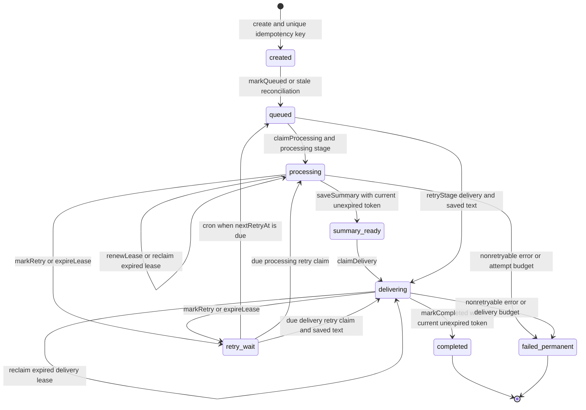

Это runtime переходы, а не буквальная копия `TRANSITIONS`: общий `transition()` проверяет таблицу из `packages/run-lifecycle`, но специализированные claim methods выполняют собственные SQL guards. Например, expired `processing → processing` и `queued → delivering` реализованы непосредственно в repository, хотя таблица `TRANSITIONS` их не перечисляет. `touch` обновляет `updated_at` у queued/summary_ready без смены status.

Processing claim увеличивает `attempt`, записывает новый random token и lease expiry, обнуляет retry fields. Он разрешён из queued с processing/no retry stage, due processing retry_wait или expired processing. Более ранний либо равный по command ID незаконченный processing-stage run того же chat блокирует claim. Partial UNIQUE index физически допускает только одну строку `status='processing'` на chat. Это не сериализация всех внешних effects: `summary_ready`, delivery retry и delivering более ранней команды не блокируют вычисление следующей.

Delivery claim требует сохранённого summary ciphertext, увеличивает независимый `deliveryAttempt` и выдаёт новый token. `claimWork` сначала проверяет terminal/missing, затем пробует delivery, затем processing. `completed`/`failed_permanent` не запускаются заново от повторного Queue job. `DEFER_*`, `SKIP_*`, `empty` — semantic outcomes, **не lifecycle statuses**: успешная доставка их уведомления также заканчивается `completed`.

В исходниках lease — 2 минуты, processing heartbeat — 30 секунд, обычная logical retry delay — 30 секунд, pending — 5 секунд. Processing и delivery имеют budget 4; проверки `>4` перед работой отсекают лишний claim, а processing error на попытке 4 уже permanent. Retryable delivery error на попытке 4 ещё может записать retry_wait; следующий delivery claim с номером 5 завершит run без новой отправки. Cron настроен каждые 5 минут; stale threshold созданных/queued/summary_ready runs — 5 минут. Это значения реализации, не обещание точного времени выполнения.

Evidence: [run-lifecycle/index.ts](../../packages/run-lifecycle/src/index.ts); [summaryLifecycle.repo.ts](../../packages/db/src/repos/summaryLifecycle.repo.ts) — `claimProcessing()`, `claimDelivery()`, `markRetry()`; [lifecycle/worker.ts](../../apps/cloudflare/src/lifecycle/worker.ts); [summary-lifecycle-storage.test.ts](../../test/summary-lifecycle-storage.test.ts).

## Window selection model

**Вопрос схемы 6: почему модель видит сообщения, которые не потребляет?** `listByChat` загружает всю сохранённую text/non-command историю chat; bounded selection происходит в памяти.

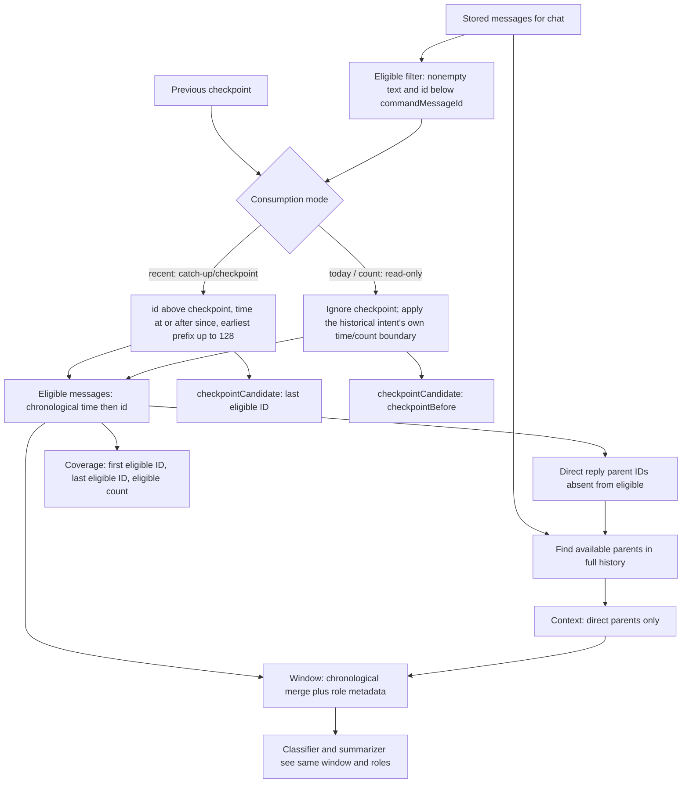

| Mode                   | Eligible lower boundary                                                    | Upper boundary                  | Направление и лимит                                    | Consumption  |
| ---------------------- | -------------------------------------------------------------------------- | ------------------------------- | ------------------------------------------------------ | ------------ |
| `recent` (`/summary`)  | `id > checkpointBefore`, если он есть; `time >= command.date - 86_400_000` | `id < command.commandMessageId` | Старейшие 128 по `(time, id)`                          | `checkpoint` |
| `today`                | Нет checkpoint filter; `time >= new Date(command.date).setHours(0,0,0,0)`  | Такой же ID guard               | Старейшие 128 по `(time, id)`                          | `read-only`  |
| `count` (`/summary N`) | Нет checkpoint/time filter                                                 | Такой же ID guard               | Новейшие N, потом chronological order; N ограничен 128 | `read-only`  |

`recent` не означает «вся когда-либо непрочитанная история»: у него rolling-day filter. `today` использует local day boundary JavaScript процесса, а не timezone Telegram user/chat; явной настройки timezone здесь нет. Command date и ID фиксируются при создании run, но история до этого ID не snapshot-ится тогда: поздно пришедшее старое сообщение может попасть в повторное вычисление до первого persisted outcome.

**Eligible** — выбранные сообщения, о которых эта команда принимает semantic решение. **Context** — найденные прямые reply parents вне eligible. Parent может лежать за checkpoint или за time boundary; поиск context не повторяет eligible filters и не делает рекурсивного обхода ancestors. Если parent отсутствует в истории, он не выдумывается и не загружается из Telegram. Сам факт отсутствующего parent не принуждает `DEFER_CONTEXT`: решение принимается из model predicates.

**Window** объединяет eligible и context; `createConversationWindow` проверяет непустоту, один chat, уникальность message IDs и chronological order, копирует и замораживает данные. **Coverage** с самого начала строится только из `SelectedConversation.eligibleMessages`; отдельной корректирующей функции после evaluation нет. `recordAttempt` независимо выводит `from_message_id`/`to_message_id` из snapshots с role `eligible`.

**checkpointCandidate** — подсказка selector: последний chronological eligible ID в consuming mode, иначе прежний checkpoint. Это не committed cursor и не прямой аргумент SQL update; facade конструирует `checkpointAfter` из terminal coverage/consumption. Общий model window может превышать 128: лимит применяется к eligible, затем добавляются parents. Token/character budget для добавленного context selector не считает.

Evidence: [summary.window.ts](../../packages/summarize/src/summary.window.ts) — `selectSummaryWindow()`; [eligible.ts](../../packages/summarize/src/window/eligible.ts) и [context.ts](../../packages/summarize/src/window/context.ts) — selection helpers; [conversationWindow.ts](../../packages/shared/src/conversationWindow.ts); [prompt.ts](../../packages/summarize/src/model/prompt.ts) — `INPUT_ROLES`; [transcript.ts](../../packages/summarize/src/model/transcript.ts) — `encodePipeWindow()`; [summarize-boundaries.test.ts](../../test/summarize-boundaries.test.ts).

## Checkpoint semantics

**Вопрос схемы 5: какая запись меняет следующий `/summary`?** Consumption — совместное правило selector/facade и repository reader, а не только решение classifier.

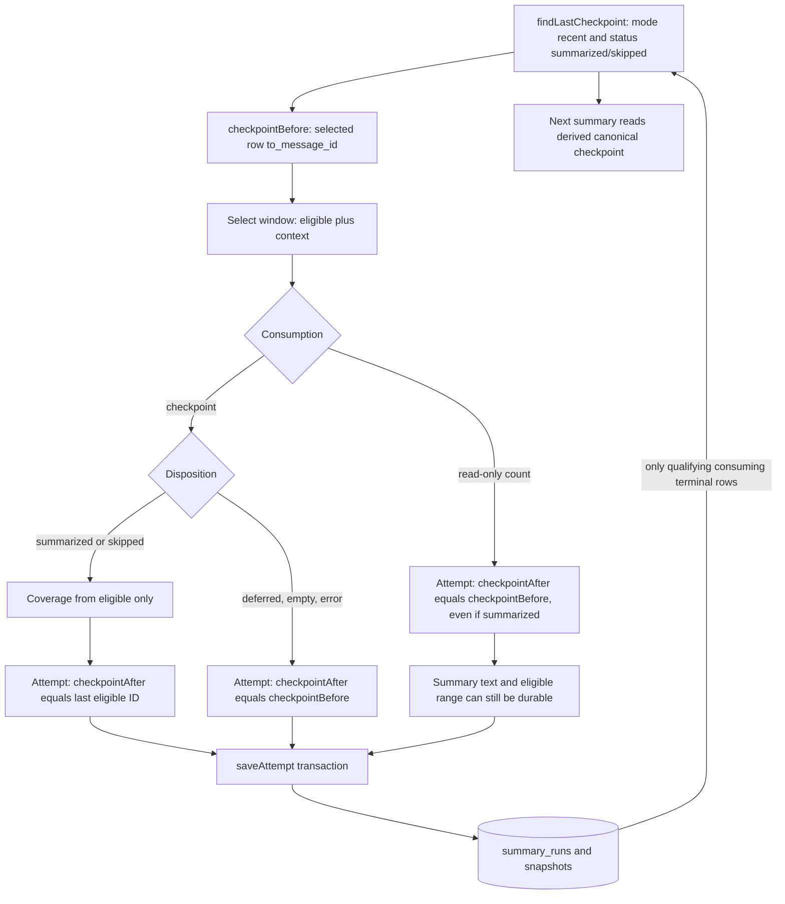

Правило lookup дословно по query: chat lookup key; `mode = 'recent'`; `status IN ('summarized','skipped')`; сортировка `command_message_id DESC`, `orchestration_attempt DESC`, `created_at DESC`; одна строка; вернуть её `from_message_id`, `to_message_id`, `message_count`. Если qualifying row нет либо её range содержит null, результата нет. Проверки lifecycle `completed`, action, policy hash или `checkpoint_after` в этом query нет. Чтение не требует расшифровки summary text.

| Outcome attempt | `recent` (catch-up)                                                     | `today` / `count` (historical)                                      | Что остаётся для последующей команды                                |
| --------------- | ----------------------------------------------------------------------- | ------------------------------------------------------------------- | ------------------------------------------------------------------- |
| `summarized`    | После принятого commit становится checkpoint evidence                   | Текст и coverage сохраняются, checkpoint прежний                    | Consuming history после новой границы; count ничего не убирает      |
| `skipped`       | Сохраняется terminal attempt с текстом объяснения, граница потребляется | Attempt сохраняется без продвижения; см. drift о presentation reuse | Consuming skip не классифицируется повторно                         |
| `deferred`      | Attempt сохраняется, checkpoint прежний                                 | То же                                                               | Материал остаётся eligible, если проходит границы следующей команды |
| `empty`         | Attempt без выбранных snapshots, checkpoint прежний                     | То же                                                               | Нового потребления нет                                              |
| `error`         | Если удаётся, записывается evidence ошибки; checkpoint прежний          | То же                                                               | Новый processing attempt может вычислять заново                     |

Политика `shouldAdvanceCheckpoint()` допускает успешный `SUMMARIZE` и `SKIP_*`, запрещает `DEFER_*`/`EMPTY`; facade дополнительно требует `selected.consumption === 'checkpoint'`. Это свойство выводится из request intent (`recent`), а не из геометрии окна или способа получения artifact. Поэтому exact cache hit продвигает catch-up, но не продвигает совпавший с ним `today`/`count`. Reader принимает только mode `recent`.

После commit attempt, но до `saveSummary`, Telegram delivery и `markCompleted`, canonical checkpoint уже может быть новым. Поздняя validation/delivery failure его не откатывает. Это граница **принятого semantic результата**, а не «пользователь прочитал сообщение». При повторе того же run Processor сначала ищет non-error outcome; он не делает новую selection от уже продвинутого checkpoint.

Монотонность здесь условная: query выбирает последнюю команду, не максимальный message ID. Порядок обработки ранее созданных команд и chronological input поддерживает ожидаемый рост, но произвольные несогласованные `(time, id)`, поздняя доставка старых команд или прямые записи в ledger не превращаются автоматически в монотонный cursor. Эти пределы нельзя скрывать общей формулировкой «checkpoint всегда растёт».

Evidence: [attempt.ts](../../packages/summarize/src/execution/attempt.ts) — `executeSummaryAttempt()`; [SummaryAttemptRecorder.ts](../../packages/summarize/src/execution/SummaryAttemptRecorder.ts) — `persist()`; [consumption.ts](../../packages/summarize/src/window/consumption.ts); [summary-attempt.repository.ts](../../packages/db/src/repositories/summary-attempt.repository.ts) — consumption-boundary lookup and `recordAttempt()`; [count-checkpoint.test.ts](../../test/count-checkpoint.test.ts); [summary-ledger-runtime.test.ts](../../test/summary-ledger-runtime.test.ts).

## Failure and recovery model

**Вопрос схемы 7: какой механизм отвечает за повтор после каждого вида сбоя?** Queue retry и logical retry — разные контуры. Queue retry повторяет тот же transport message после RPC exception. Logical retry сначала меняет durable lifecycle state и публикует replacement message; cron является независимым repair loop.

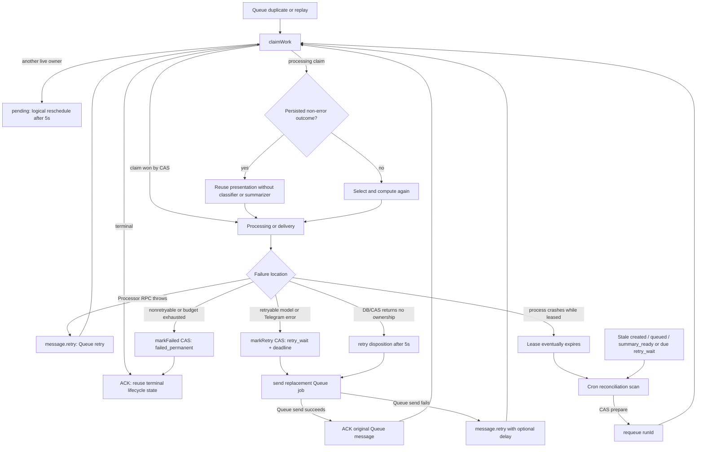

### Что защищено каким механизмом

| Операция                              | Реальная защита                                                                  | Что она гарантирует                                                                                                                          |
| ------------------------------------- | -------------------------------------------------------------------------------- | -------------------------------------------------------------------------------------------------------------------------------------------- |
| Message save                          | Транзакция + per-chat advisory transaction lock + upsert                         | Повтор одной записи обновляет тот же `(chat, messageId)`; child effects нет                                                                  |
| Run create                            | Транзакция + тот же advisory lock + UNIQUE HMAC idempotency key                  | Concurrent replay получает один durable lifecycle row                                                                                        |
| Claim/transition/saveSummary/complete | Conditional SQL update; для leased операций token + unexpired lease              | CAS fencing: старый owner не может записать lifecycle transition после утраты ownership                                                      |
| `saveAttempt`                         | Одна DB transaction; сначала lease/attempt fence, затем insert parent и children | Ledger attempt и его snapshots/model evidence/catalog update коммитятся вместе либо не коммитятся; stale owner silently не вставляет attempt |
| Queue logical reschedule              | Send replacement, затем ACK original                                             | Ошибка replacement send оставляет original на retry; дубликаты допустимы                                                                     |
| Reconciliation publish                | CAS/touch в БД, затем `sendBatch` вне transaction                                | Concurrent cron snapshots не публикуют одну и ту же подготовку; crash между prepare и send чинится последующим stale scan                    |
| Telegram preview/final send           | External side effect, вне DB transaction                                         | Нет atomic commit с PostgreSQL; delivery guarantee слабее exactly-once                                                                       |
| Logs, traces, Analytics Engine        | `try/catch` или после Queue ACK в критических местах                             | Best effort observability не должна менять Queue disposition                                                                                 |

DB connection failure до получения результата RPC может дойти до Queue handler как RPC exception и вызвать Queue retry. Внутри processing `classifyFailure()` распознаёт retryable `OllamaError` только для 429/5xx и Telegram delivery error для 429/5xx; известные validation/config TypeError и остальные unknown errors считаются permanent. Поэтому «DB failure всегда retryable» было бы неверным: исключение после успешного claim, попавшее в `handleProcessingError`, по умолчанию классифицируется как nonretryable и пытается перевести run в `failed_permanent`; если сама запись failure не удалась, consumer получает retry disposition.

Queue configuration принимает batch size 1, делает до трёх Queue retries и имеет DLQ. Это transport budget, независимый от `attempt`/`deliveryAttempt` в БД. Логический retry публикует новое Queue сообщение и ACK-ит старое, поэтому может пережить исчерпание retry count старого сообщения. Cron может восстановить durable nonterminal run даже после потери Queue message.

### Persisted outcome reuse

После получения processing lease Processor ищет последнюю non-error строку `summary_runs` для этого orchestration run, сортируя по orchestration attempt. Для `summarized` он расшифровывает сохранённый текст; для `empty` строит стандартное «нет новых сообщений»; для `deferred` восстанавливает presentation из action. Затем всё равно выполняются validation, lifecycle `saveSummary`, delivery claim и delivery.

Error attempt намеренно не считается reusable outcome: новый claim заново читает текущую history/checkpoint и вызывает models. Unique `(orchestration_run_id, orchestration_attempt)` и deterministic attempt ID `<runId>:attempt:<attempt>` делают повторный save одной orchestration attempt no-op. Они не дедуплицируют model calls, произошедшие до commit.

Независимо от orchestration retry workflow выполняет semantic lookup после resolve/select и до classifier. Exact key равен `(scope=chatId, start=firstEligibleId, end=commandMessageId, eligibleCount, inputHash, policyHash)`. `inputHash` вычисляется над immutable eligible+context snapshots с ролями; поэтому edit, изменение reply context или состава сообщений превращает overlap/exact geometry в cache miss. `policyHash` версионирует совместимость summary policy. При hit создаётся новая attempt evidence и новый artifact identity, но текст/skip action переиспользуется без model calls. Overlap, containment и hull сами по себе reuse не разрешают: final summary lossy и не имеет алгебры окон.

Evidence: [summary-queue-consumer.ts](../../apps/cloudflare/src/ingress/summary-queue-consumer.ts) — `rescheduleLogicalRun()`; [failure-policy.ts](../../apps/cloudflare/src/processor/failure-policy.ts) — `classifyFailure()`; [lifecycle/worker.ts](../../apps/cloudflare/src/lifecycle/worker.ts) — scheduled handler; [summary-execution.repository.ts](../../packages/db/src/repositories/summary-execution.repository.ts); [reconciler-matrix.test.ts](../../test/reconciler-matrix.test.ts); [queue-runtime.test.ts](../../apps/cloudflare/test/queue-runtime.test.ts).

## Failure walkthrough

Самая показательная неоднозначность находится между успешным Telegram send и `markCompleted`: external side effect уже необратим, а durable receipt ещё отсутствует.

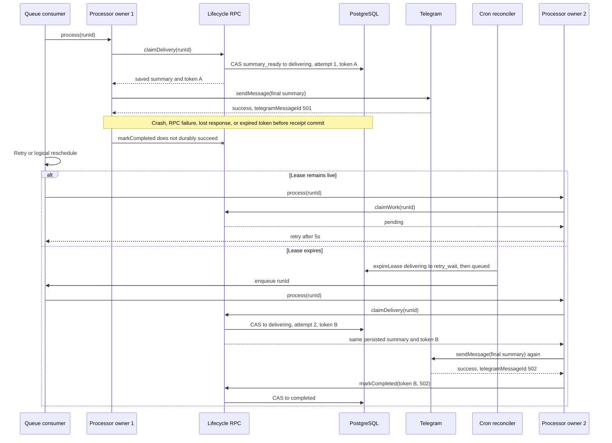

Итог: summary не вычисляется повторно, но финальная Telegram отправка может дублироваться. `EXTERNAL_DELIVERY_GUARANTEE` честно называется `best-effort-exactly-once`. В группе normal progressive commit часто редактирует уже созданный preview; после restart process-local message ID потерян, fallback delivery создаёт новое сообщение. В private chat final commit всегда `sendMessage`, поэтому ambiguity та же.

Другой crash boundary — после `saveAttempt`, но до lifecycle `saveSummary`. Здесь semantic outcome и checkpoint уже durable, lifecycle остаётся processing до retry/recovery. Следующая processing attempt найдёт outcome и пропустит models. Если committed attempt имеет status `error`, reuse не происходит.

## Persistence and transaction boundaries

**Вопрос схемы 9: где существует atomicity?** Каждый блок `TX` — отдельная PostgreSQL transaction/statement. Между блоками нет общей transaction; Service Binding и Telegram не участвуют в database commit.

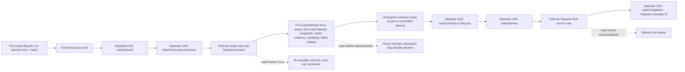

Канонический `recordAttempt` начинает transaction с conditional update lifecycle `updated_at`. Недействительный lease возвращает `ownershipLost` без insert. Insert conflict возвращает `alreadyCommitted` с outcome именно существующей записи (для error evidence outcome отсутствует). Успешная запись возвращает `committed`. Fence, parent attempt, snapshots, model invocations, candidate и WMA catalog upsert остаются в одной transaction. Legacy `saveAttempt` адаптирует ответ к `void`; production использует `recordAttempt`.

Workflow проверяет semantic output до record: пустая строка, NUL и служебные теги отклоняются с error evidence без consumption/WMA projection. После commit Processor отдельно проверяет Telegram payload, включая 4096-лимит. При `alreadyCommitted` Processor прекращает новое preview и представляет существующий outcome; при `ownershipLost` возвращается к retry. Evidence: [semantic-acceptance.test.ts](../../test/semantic-acceptance.test.ts), [summary-ledger.test.ts](../../test/summary-ledger.test.ts).

`saveSummary` дублирует presentation в mutable lifecycle row, чтобы delivery мог продолжаться без расшифровки/интерпретации ledger outcome на каждом retry. Это отдельный CAS после validation. `markCompleted` фиксирует delivery receipt отдельно после Telegram. Нельзя изображать `saveAttempt + send + completed` одной атомарной операцией.

Ingress `create` transaction заканчивается до Queue send. Если Queue send падает, webhook возвращит failure, Telegram может повторить update, а idempotent create вернёт тот же run. Если Queue send удался, но background `markQueued` нет, run остаётся `created`; ранний processor увидит pending, а retries/cron могут перевести его в queued.

## Package and platform boundaries

**Вопрос схемы 10: кто задаёт domain vocabulary, кто выполняет effects и где platform wiring?** Это architectural dependency map, а не исчерпывающий import graph.

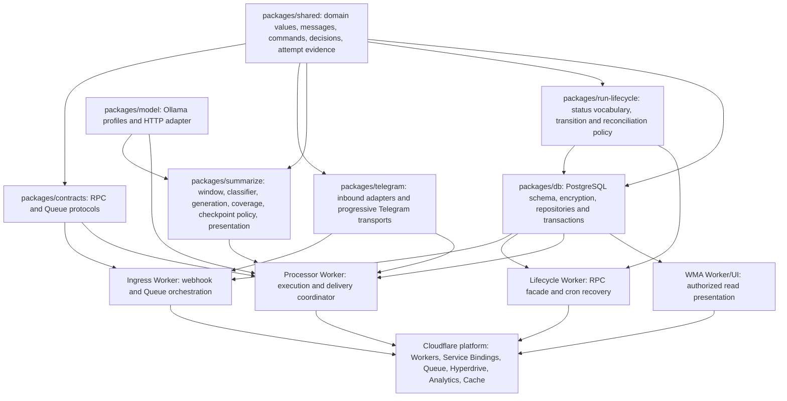

`shared` определяет переносимые immutable shapes и brands, но не policy выбора. `summarize` владеет semantic workflow и presentation для dispositions; его ports (`MessageReader`, `SummaryRunStore`) позволяют runtime подставить repositories. `db` реализует оба вида persistent state: immutable-ish evidence ledger и mutable operational lifecycle. `run-lifecycle` содержит чистую vocabulary/reconciliation decision, а Lifecycle Worker добавляет часы, leases и I/O.

Telegram package делится на inbound parsing и outbound progressive transport. Обычная non-progressive `sendTelegramMessage` и классификация HTTP delivery errors находятся непосредственно в Processor Worker. WMA — read-only projection boundary над catalog/ledger плюс Telegram membership authorization; он не читает lifecycle и не влияет на checkpoint.

Cloudflare bindings связывают Workers. Queue consumer объявлен у Ingress Worker, Processor доступен как Service Binding RPC, Lifecycle — Service Binding RPC и cron Worker. Hyperdrive предоставляет connection string к PostgreSQL, но repositories используют `drizzle-orm/node-postgres`, а request-scoped client закрывается после каждой operation.

Application observability отделена от acceptance orchestration: ingress use cases сообщают typed domain observations, а их адаптеры fan-out'ят события в structured log и Analytics Engine. Custom spans обозначают application operations; инфраструктурные Queue/Service Binding/HTTP spans остаются ответственностью Cloudflare runtime, поэтому Queue consumer не создаёт дочерний span на каждое сообщение. Это не меняет durability protocol и не превращает `markQueued` в telemetry: он остаётся явной background best-effort lifecycle operation. Полные репозиторные правила находятся в [observability.md](./observability.md).

## Architectural invariants

### INV-01 — Historical summaries are read-only

Statement: `/summary today` и `/summary N` могут сохранить summary и eligible range, но не становятся источником canonical checkpoint.

Enforced by:

- selector присваивает `today`/`count` `consumption: 'read-only'`;
- facade сохраняет `checkpointAfter === checkpointBefore`;
- `findLastCheckpoint` фильтрует mode до `recent`; `today` и `count` read-only.

Evidence: [summary.window.ts](../../packages/summarize/src/summary.window.ts), [summary.workflow.ts](../../packages/summarize/src/summary.workflow.ts), [summaries.repo.ts](../../packages/db/src/repos/summaries.repo.ts), [count-checkpoint.test.ts](../../test/count-checkpoint.test.ts).

Violation would cause: исторический query пропустил бы pending messages для следующего consuming summary.

### INV-02 — Coverage contains eligible messages only

Statement: reply context видят classifier/summarizer, но `covers`, from/to IDs, message count и checkpoint advancement относятся только к eligible messages.

Enforced by:

- role-aware selector и prompt envelope;
- `evaluateSummaryWindow()` получает `selected.eligibleMessages` и сразу строит eligible coverage; исправляющей `withEligibleCoverage()` больше нет;
- `saveAttempt` отдельно ищет first/last snapshot с role eligible.

Evidence: [summarize-v01.test.ts](../../test/summarize-v01.test.ts) — reply-parent test; [summarize-boundaries.test.ts](../../test/summarize-boundaries.test.ts).

Violation would cause: старый parent считался бы новым потреблённым материалом и искажал checkpoint/range.

### INV-03 — Deferred, empty, and failed attempts do not advance checkpoint

Statement: `DEFER_*`, пустая selection и error evidence сохраняют прежнюю границу. Deferred eligible material может снова войти в окно следующей команды, если проходит её time/ID filters.

Enforced by: `shouldAdvanceCheckpoint()`, `run()` и status/mode filters `findLastCheckpoint()`.

Evidence: [checkpoint-policy.test.ts](../../test/checkpoint-policy.test.ts); [summary-ledger.test.ts](../../test/summary-ledger.test.ts) — deferred persistence; [summary-ledger-runtime.test.ts](../../test/summary-ledger-runtime.test.ts) — provider failure.

Violation would cause: незавершённый или неразобранный материал исчезал бы из будущих summaries.

### INV-04 — Intentional skip consumes only a checkpoint-mode window

Statement: `SKIP_*` создаёт terminal checkpoint evidence только для catch-up `recent`, чтобы low-value eligible messages не классифицировались бесконечно; historical `today`/`count` skip остаётся read-only.

Enforced by: `shouldAdvanceCheckpoint(SKIP_*)`, consumption guard в facade и reader mode filter.

Evidence: [summarize-v01.test.ts](../../test/summarize-v01.test.ts) — skipped boundary; [consumption.ts](../../packages/summarize/src/window/consumption.ts).

Violation would cause: reactions/banter либо застревали бы в каждом окне, либо count неожиданно потреблял бы историю.

### INV-05 — Attempt evidence is accepted only from the current processing owner

Statement: orchestrated `saveAttempt` может коммитнуть rows только если lifecycle run находится в `processing`, attempt number и lease token совпадают, а lease ещё действует.

Enforced by: первый conditional update внутри transaction `SummariesRepo.saveAttempt`; unique orchestration-attempt index.

Evidence: [summaries.repo.ts](../../packages/db/src/repos/summaries.repo.ts) — `saveAttempt()`; [summary-ledger.test.ts](../../test/summary-ledger.test.ts) — expired lease rejection.

Violation would cause: результат старого processor после lease takeover мог бы стать checkpoint или WMA summary.

### INV-06 — Operational lifecycle writes are lease-fenced

Statement: `saveSummary`, `markRetry`, `markFailed`, `markCompleted` и `renewLease` требуют current token, ожидаемый status и unexpired lease.

Enforced by: conditional updates в `SummaryLifecycleRepo`; schema checks связывают leases только со status processing/delivering.

Evidence: [summaryLifecycle.repo.ts](../../packages/db/src/repos/summaryLifecycle.repo.ts); [summary-lifecycle-storage.test.ts](../../test/summary-lifecycle-storage.test.ts) — expired-owner fencing.

Violation would cause: два owners могли бы одновременно завершить или переопределить run.

### INV-07 — At most one processing lifecycle row exists per chat

Statement: одновременно DB допускает не больше одной строки `status='processing'` для encrypted chat key; claim дополнительно блокируется незавершённой более ранней processing-stage командой.

Enforced by: partial unique index и `notExists(earlier_summary_run)` в claim query.

Evidence: [schema.ts](../../packages/db/src/schema.ts); [summaryLifecycle.repo.ts](../../packages/db/src/repos/summaryLifecycle.repo.ts); [summary-lifecycle-storage.test.ts](../../test/summary-lifecycle-storage.test.ts) — different commands.

Violation would cause: два summary одного chat могли бы выбрать один checkpoint и независимо потребить пересекающиеся окна.

### INV-08 — Queue duplication does not duplicate logical run identity

Statement: repeated Telegram command update создаёт тот же lifecycle row; repeated Queue jobs должны либо проиграть claim CAS, либо увидеть pending/terminal/delivery state.

Enforced by: UNIQUE idempotency key, get-or-create, claim CAS, terminal short circuit.

Evidence: [summaryLifecycle.repo.ts](../../packages/db/src/repos/summaryLifecycle.repo.ts) — `create()`/claims; [summary-lifecycle-storage.test.ts](../../test/summary-lifecycle-storage.test.ts) — concurrent creation and claims; [queue-runtime.test.ts](../../apps/cloudflare/test/queue-runtime.test.ts).

Violation would cause: одна команда запустила бы независимые model calls и lifecycle deliveries.

### INV-09 — A reusable semantic outcome precedes lifecycle delivery text

Statement: normal path сначала коммитит non-error attempt, затем validates/persists presentation в lifecycle. Retry после первого commit переиспользует outcome, а не model.

Enforced by: порядок в `processRun()` и `findOrchestratedOutcome()` перед созданием summarizer.

Evidence: [processor/worker.ts](../../apps/cloudflare/src/processor/worker.ts); [summaries.repo.ts](../../packages/db/src/repos/summaries.repo.ts).

Violation would cause: crash после model result вызывал бы новое вычисление с другим окном/выводом или не имел durable provenance.

### INV-10 — WMA is a ledger projection, not lifecycle truth

Statement: WMA показывает только `summary_runs.status='summarized'` с ciphertext и их snapshots; run completion/delivery status не участвует в запросах WMA.

Enforced by: WMA SQL filters и catalog upsert в `saveAttempt`.

Evidence: [wma bootstrap.ts](../../apps/cloudflare/src/wma/src-api/bootstrap.ts); [summaries.repo.ts](../../packages/db/src/repos/summaries.repo.ts) — `upsertWmaCatalog()`; migrations `0013`–`0016`.

Violation would cause: home/detail и checkpoint/attempt ledger расходились бы по источнику данных.

### INV-11 — External delivery is not claimed as exactly-once

Statement: Telegram send/edit и `markCompleted` разделены; повтор после неоднозначного external success может повторить delivery. В частности, `TELEGRAM_NETWORK_ERROR` после отправки request body не доказывает, что Telegram не принял сообщение.

Enforced by: явная константа `best-effort-exactly-once` и receipt persistence после external call. Processor проецирует `TELEGRAM_NETWORK_ERROR` в best-effort метрику `telegram.delivery.ambiguous_retry`; она не влияет на retry или durable state.

Evidence: [run-lifecycle/index.ts](../../packages/run-lifecycle/src/index.ts) — `EXTERNAL_DELIVERY_GUARANTEE`; [processor/worker.ts](../../apps/cloudflare/src/processor/worker.ts) — `deliverInsideSpan()`.

Violation would cause: документация и recovery logic обещали бы невозможную гарантию без transactional outbox/idempotency support Telegram.

### INV-12 — Observability is not a source of durable evidence

Statement: отключение или замена telemetry sink не меняет domain result и persisted `SummaryAttempt` evidence. Model invocations, prompt hashes, output statistics и model timings собирает обязательный per-run `SummaryExecutionJournal`; telemetry получает те же typed execution events только как optional projection.

Enforced by: `SummaryExecutionJournal`, composite execution recorder в `createSummaryWorkflow()` и отсутствие evidence getters у `SummarizationTelemetryTrace`.

Evidence: [SummaryExecutionJournal.ts](../../packages/summarize/src/execution/SummaryExecutionJournal.ts); [attempt.ts](../../packages/summarize/src/execution/attempt.ts); [summary-ledger-runtime.test.ts](../../test/summary-ledger-runtime.test.ts).

Violation would cause: no-op или неисправный observability adapter обеднял бы audit/regression provenance persisted attempt.

### INV-13 — Final summaries are reusable only by exact snapshot identity

Statement: overlap, containment или одинаковая геометрия окна не являются cache hit. Reuse разрешён только при равенстве scope, half-open boundaries, eligible count, полного snapshot `inputHash` и совместимого `policyHash`.

Enforced by: `identifySummaryInput()` до model processing и `SummaryAttemptRepository.findReusableOutcome()` с conjunctive lookup по всем частям identity; partial index `idx_summary_runs_exact_reuse` обслуживает terminal lookup. Hit всё равно сохраняет новую attempt и применяет checkpoint transition из intent текущего request.

Evidence: [summary.input.ts](../../packages/summarize/src/summary.input.ts); [attempt.ts](../../packages/summarize/src/execution/attempt.ts); [summary-attempt.repository.ts](../../packages/db/src/repositories/summary-attempt.repository.ts); [summary-cache.test.ts](../../test/summary-cache.test.ts); [window-algebra.test.ts](../../test/window-algebra.test.ts).

Violation would cause: lossy summary одного окна подменял бы вычисление другого либо cache hit исторического запроса ошибочно управлял бы cursor.

## Component cards

### Ingress Worker

Responsibility: проверить webhook transport, нормализовать обычное сообщение, распознать команду, создать durable run и передать его identity в Queue. Queue handler этого же Worker переводит Processor disposition в ACK/retry/reschedule.

Owns: Telegram webhook acceptance order, idempotency-key construction, Queue message protocol usage, typed ingress observations и webhook response boundary.

Does NOT own: selection/classification/checkpoint policy, lifecycle transition SQL, model calls или final summary validation.

Reads: HTTP request/update, secrets, Queue message `{runId}`. Writes: `messages` через repo; lifecycle через RPC; Queue. Durable side effects: message/run/Queue writes. Upstream: Telegram и Queue. Downstream: Lifecycle, Processor, PostgreSQL.

Important invariants: команда не попадает в canonical messages; Queue ACK следует Processor disposition; replacement job принимается до ACK original.

Failure semantics: malformed Queue job ACK; Processor RPC exception Queue-retry; Queue reschedule failure retry original; failed Queue send during webhook leaves idempotent run for webhook retry/cron.

Key entry points: [ingress/worker.ts](../../apps/cloudflare/src/ingress/worker.ts) — transport-only routing; [telegram-webhook-handler.ts](../../apps/cloudflare/src/ingress/telegram-webhook-handler.ts) — `handleTelegramWebhook()`; [summary-command-ingress.ts](../../apps/cloudflare/src/ingress/summary-command-ingress.ts) — durable command acceptance; [summary-command-observability.ts](../../apps/cloudflare/src/ingress/summary-command-observability.ts) — command observation projection; [summary-queue-consumer.ts](../../apps/cloudflare/src/ingress/summary-queue-consumer.ts) — `handleSummaryQueue()`; [summary-queue-observability.ts](../../apps/cloudflare/src/ingress/summary-queue-observability.ts) — Queue observation projection.

### SummaryLifecycleRepo and Lifecycle Worker

Responsibility: хранить mutable state machine, выдавать/fence processing и delivery leases, назначать retry deadlines, сканировать и requeue stale/due runs.

Owns: operational run state, counters, lease tokens/expiry, saved delivery text, delivery receipt, recovery preparation.

Does NOT own: semantic attempt status/action, window/coverage/checkpoint semantics, Telegram send или model output.

Reads: lifecycle rows и clock. Writes: `summary_run_lifecycle`, Queue from cron. Durable side effects: conditional lifecycle updates и recovery jobs. Upstream: Ingress/Processor RPC, cron. Downstream: Processor и Queue.

Important invariants: current unexpired lease fences writes; one processing row per chat; retry stage chooses next claim kind.

Failure semantics: CAS loser returns false/undefined; expired leases become retry_wait then queued; prepare-before-publish gap is repaired by a later stale scan.

Key entry points: [summaryLifecycle.repo.ts](../../packages/db/src/repos/summaryLifecycle.repo.ts); [lifecycle/worker.ts](../../apps/cloudflare/src/lifecycle/worker.ts) — `SummaryRunsEntrypoint`, scheduled handler.

### SummaryProcessorEntrypoint

Responsibility: соединить lifecycle ownership с semantic pipeline, presentation validation, durable delivery text и Telegram delivery.

Owns: порядок claim → reuse/generate → validate → `saveSummary` → delivery claim → send → complete; runtime error taxonomy и attempt budgets.

Does NOT own: lifecycle transition guards, checkpoint query, classifier predicates policy или WMA representation.

Reads: lifecycle claims, persisted outcomes, environment/model config. Writes: через Summary/Lifecycle repos; Telegram previews/finals; telemetry. Upstream: Ingress Queue handler. Downstream: Summarize package, Ollama, Telegram, Lifecycle.

Important invariants: lookup reusable outcome happens до model setup; processing heartbeat wraps semantic work; delivery starts only from durable lifecycle text.

Failure semantics: retryable model/delivery failures become retry_wait; unknown errors считаются permanent; CAS loss возвращает retry; external-send ambiguity допускает duplicate.

Key entry points: [processor/worker.ts](../../apps/cloudflare/src/processor/worker.ts) — `process()`, `processRun()`, `deliverInsideSpan()`, `classifyFailure()`.

### MessagesRepo and Telegram message adapter

Responsibility: преобразовать untrusted Telegram projection в canonical `ChatMessage`, зашифровать и сохранить его; вернуть chronological chat history.

Owns: accepted message shape и durable keying/encryption representation.

Does NOT own: completeness/order of Telegram delivery, command semantics, selection boundary, context role или checkpoint.

Reads: `update.message`, `messages`. Writes: one upsert row per `(encrypted chat, messageId)`. Upstream: Ingress. Downstream: Summarizer selector.

Important invariants: пустые/control messages не сохраняются; list возвращает только `kind=text`, `is_command=false`; message text/author label encrypted at rest.

Failure semantics: invalid/unhandled updates return undefined; DB failure prevents successful webhook path; replay safely upserts current row.

Key entry points: [chatMessage.ts](../../packages/telegram/src/chatMessage.ts) — `parseTelegramChatMessageUpdate()`; [messages.repo.ts](../../packages/db/src/repos/messages.repo.ts).

### SummaryWindowSelector

Responsibility: из history, command и checkpoint построить bounded eligible selection, direct-parent context, consumption mode и immutable model window.

Owns: `recent`/`today`/`count` boundaries, earliest/suffix direction, eligible/context distinction, 128 eligible-message cap.

Does NOT own: semantic action, generated text, committed checkpoint, database reads или retries.

Reads: in-memory messages/command/checkpoint. Writes: process-local `SelectedConversation`; durable side effects отсутствуют. Upstream: Summarizer facade. Downstream: classifier/summarizer/persistence snapshots.

Important invariants: command ID exclusive; context does not enter eligible coverage; output chronological and single-chat.

Failure semantics: no eligible messages returns null; malformed mixed-chat/order input is rejected by `createConversationWindow`.

Key entry points: [summary.window.ts](../../packages/summarize/src/summary.window.ts) — `selectSummaryWindow()`.

### Classifier and ConversationSummarizer

Responsibility: classifier получает semantic predicates от model и детерминированно переводит их в action; conversation summarizer создаёт украинский summary только для `SUMMARIZE`.

Owns: predicate schema/order policy, prompt contract, model profile use и semantic composition constraints.

Does NOT own: message eligibility, checkpoint consumption, attempt persistence, lifecycle retry classification или Telegram delivery.

Reads: один и тот же immutable window плюс role annotations. Outputs: `SummaryDecision` и optional summary text. Durable writes отсутствуют; model-boundary events направляются в execution recorder, обязательный journal проецирует из них invocation evidence, а optional telemetry observer не участвует в persistence.

Important invariants: fast classifier по умолчанию abstains; model predicates validated strictly; action выводится code; context-only rows помечены в prompt; structured и streaming generation получают одинаковые transcript/roles и semantic policy. Для gpt-oss summarizer prompt следует Harmony ownership: model metadata и каналы находятся в `system`, trusted task policy и response format — в `developer`, untrusted PIPECHAT transcript — в `user`; Ollama `thinking` остаётся внутренним и наружу выходит только final content. Structured path одновременно объявляет response schema в developer message и передаёт её как sampling grammar; streaming path использует plain-text contract и ту же semantic validation. Processor передаёт текущую UTC-дату в Harmony envelope. Summary сохраняет конкретные полезные propositions, релевантные visible author labels и named anchors вместо topic-only meta-summary.

Failure semantics: classifier повторяет один truncated/empty-output attempt с большим output budget; provider/schema failure пробрасывается facade/Processor.

Key entry points: [classifier.ts](../../packages/summarize/src/classifier/classifier.ts) — `createClassifier()`; [predicates.ts](../../packages/summarize/src/classifier/predicates.ts) — `decideFromPredicates()`; [summarizer.ts](../../packages/summarize/src/generation/summarizer.ts).

### Summarizer facade

Responsibility: прочитать history/checkpoint, выбрать окно, выполнить decision/generation, сформировать eligible-only disposition, сохранить attempt и вернуть presentation-neutral disposition Processor-у.

Owns: semantic workflow ordering, attempt construction, checkpoint advancement policy application и process-local per-chat serialization/defer streak.

Does NOT own: distributed single-chat exclusion, SQL transaction implementation, Queue/lifecycle status или final delivery completion.

Reads: `MessageHistoryReader.listByChat()`, `SummaryAttemptStore.findLatestConsumptionBoundary()` и optional exact-input reuse. Writes: `SummaryAttemptStore.recordAttempt()` (либо explicit accepted-outcome-only adapter); per-attempt execution journal; optional telemetry projection. Upstream: Processor. Downstream: selector, models, attempt repository. Контракты находятся в [summary.dependencies.ts](../../packages/summarize/src/summary.dependencies.ts).

Important invariants: terminal attempt persists before return; deferred/error preserve checkpoint; role snapshots match visible window.

Failure semantics: если основной failure случился до attempt persistence, facade пытается записать error evidence; failure этой диагностической записи логируется и исходная ошибка пробрасывается.

Key entry points: [attempt.ts](../../packages/summarize/src/execution/attempt.ts) — `executeSummaryAttempt()`; [summary.workflow.ts](../../packages/summarize/src/summary.workflow.ts) — `createSummaryWorkflow()`; [SummaryAttemptRecorder.ts](../../packages/summarize/src/execution/SummaryAttemptRecorder.ts) — attempt persistence; [SummaryExecutionJournal.ts](../../packages/summarize/src/execution/SummaryExecutionJournal.ts) — durable provenance projection; [summary.window.ts](../../packages/summarize/src/summary.window.ts); [summary.evaluation.ts](../../packages/summarize/src/summary.evaluation.ts); [summary.outcome.ts](../../packages/summarize/src/summary.outcome.ts); [record.ts](../../packages/summarize/src/execution/record.ts).

### SummariesRepo

Responsibility: атомарно принять fenced attempt и child evidence, обслужить checkpoint/outcome reads и поддержать WMA catalog projection.

Owns: physical ledger transaction, encryption/lookup keys, qualifying checkpoint SQL, reusable outcome query.

Does NOT own: выбор eligible, meaning action, lifecycle transition после semantic result, Telegram delivery или WMA authorization.

Reads: `summary_runs` и current lifecycle row. Writes: `summary_runs`, snapshots, model evidence, candidate и catalog в одной transaction. Upstream: Summarizer facade/Processor. Downstream: next summary, Processor reuse, WMA.

Important invariants: summarized attempt has encrypted text; stale orchestration owner inserts nothing; duplicate orchestration attempt does not duplicate children/catalog.

Failure semantics: transaction rollback исключает partial child evidence; legacy `saveRun` имеет отдельную non-fenced upsert path.

Key entry points: [summaries.repo.ts](../../packages/db/src/repos/summaries.repo.ts) — `saveAttempt()`, `findLastCheckpoint()`, `findOrchestratedOutcome()`.

### WMA API boundary

Responsibility: проверить Telegram initData/current membership и представить catalog, paginated summarized ledger entries и snapshots.

Owns: WMA authorization, page/cursor mapping, response/cache policy и presentation shape.

Does NOT own: run creation, attempt/checkpoint semantics, lifecycle/delivery status или canonical writes.

Reads: `wma_chat_catalog`, summarized `summary_runs`, `summary_run_messages`; Telegram membership/chat metadata. Writes: edge cache only. Upstream: WMA client. Downstream: PostgreSQL, Telegram API, Cloudflare Cache.

Important invariants: auth/network failure denies access; detail is chat-scoped; UI does not reconstruct home from lifecycle.

Failure semantics: malformed auth → 401, inaccessible chat → 403, other failure → 500; cache miss does not alter canonical state.

Key entry points: [wma worker.ts](../../apps/cloudflare/src/wma/src-api/worker.ts); [wma bootstrap.ts](../../apps/cloudflare/src/wma/src-api/bootstrap.ts).

## Concepts that look similar but are not the same

| Concepts                                          | Различие                                                                                                                                                                                                          |
| ------------------------------------------------- | ----------------------------------------------------------------------------------------------------------------------------------------------------------------------------------------------------------------- |
| Run vs attempt                                    | Run — одна durable command/lifecycle identity с mutable status и несколькими counters. Attempt — immutable-ish evidence одной processing attempt; у run может быть error attempt, затем terminal outcome attempt. |
| Lifecycle `attempt` vs `deliveryAttempt`          | Первый увеличивается при processing claim, второй — при delivery claim. Retry stage определяет, какой budget и claim продолжать.                                                                                  |
| Window vs coverage                                | Window — всё, что видят models, включая context. Coverage — только eligible range, за который отвечает disposition/checkpoint evidence.                                                                           |
| Eligible vs context                               | Eligible классифицируется и может потребляться. Context-only parent помогает разрешать ссылку, но prompt запрещает считать его новым событием или включать в coverage.                                            |
| `checkpointCandidate` vs `checkpointAfter`        | Candidate вычисляет selector до semantic outcome. After записывает facade как evidence фактического consumption результата; deferred/error/count оставляют before.                                                |
| `checkpoint_after` column vs canonical checkpoint | Column описывает одну attempt. Canonical checkpoint — query выбранной `recent` + `summarized/skipped` строки и её `to_message_id`.                                                                                |
| Summary result vs presentation                    | Result — semantic disposition/summary и evidence в ledger. Presentation — текст пользователю: generated summary либо canned empty/defer/skip explanation; lifecycle хранит именно deliverable text.               |
| Attempt persistence vs `saveSummary`              | Первая transaction делает outcome/checkpoint/snapshots durable. Второй CAS отдельно копирует validated presentation в lifecycle и переводит run в `summary_ready`.                                                |
| Processing completion vs delivery completion      | `summary_ready` означает durable deliverable text после semantic work. `completed` означает, что Telegram call вернул message ID и receipt был записан.                                                           |
| Queue retry vs logical retry                      | Queue retry повторяет current transport message после RPC/Queue failure. Logical retry хранится в lifecycle и создаёт replacement message с delay; cron может восстановить его независимо.                        |
| Canonical state vs WMA projection                 | Ledger/messages/lifecycle обслуживают correctness разных контуров. Catalog и caches ускоряют/представляют только summarized ledger rows и могут быть перестроены.                                                 |
| Per-chat serialization vs DB single-chat claim    | `pendingByChat` сериализует только вызовы одного созданного Summarizer instance. Partial DB index и claim query обеспечивают distributed processing exclusion.                                                    |
| Preview vs final delivery                         | Preview — draft/editable Telegram side effects во время streaming и process-local state. Final delivery происходит после `saveSummary`/delivery claim и только receipt переводит run в completed.                 |

## Mental execution examples

Во всех примерах `cN` — command ID, не строка в `messages`; все названные сообщения проходят relevant time boundary и идут по времени в указанном порядке.

### Example A — обычный `/summary`

History: `m1` уже покрыт предыдущим consuming attempt; затем `m2`, `m3`, `m4`; command `c5=/summary`.

1. `checkpointBefore=m1`.
2. Eligible — `[m2,m3,m4]`, context — `[]`, consumption — checkpoint.
3. Classifier выбирает `SUMMARIZE`; summarizer создаёт текст.
4. Attempt: status `summarized`, coverage `m2..m4/count=3`, snapshots роли eligible, `checkpointAfter=m4`.
5. После commit `findLastCheckpoint` возвращает boundary `m4`; lifecycle отдельно проходит `summary_ready → delivering → completed`.

### Example B — `/summary N`

History: `m1..m5`, canonical checkpoint `m2`; command `c6=/summary 2`.

1. `checkpointBefore=m2`, но count selection его не использует как lower bound.
2. Eligible — newest suffix `[m4,m5]`; context — `[]`; consumption — read-only.
3. Пусть action `SUMMARIZE`: attempt хранит summary и coverage `m4..m5/count=2`.
4. `checkpointAfter=m2`, а `findLastCheckpoint` игнорирует count row.
5. Следующий recent по-прежнему рассматривает `[m3,m4,m5]`, если они проходят его day boundary.

### Example C — reply context

History: `m1="Deploy which build?"`, `m2` уже checkpoint, `m3="The release candidate"` explicitly replies to `m1`; command `c4`.

1. `checkpointBefore=m2`.
2. Eligible — `[m3]`; selector видит parent ID `m1`, отсутствующий в eligible, и находит его в full history.
3. Context — `[m1]`; model window chronological `[m1(context),m3(eligible)]`.
4. При `SUMMARIZE` attempt snapshots содержат оба сообщения, но coverage — `m3..m3/count=1`.
5. `checkpointAfter=m3`; `m1` не потребляется заново и не увеличивает message count.

### Example D — DEFER

History после `checkpointBefore=m1`: `m2="Есть два варианта"`, `m3="Напишу их следующим сообщением"`; command `c4`.

1. Eligible — `[m2,m3]`, context — `[]`.
2. Classifier predicates дают `DEFER_INCOMPLETE`; summarizer model не вызывается.
3. Attempt status `deferred`, action `DEFER_INCOMPLETE`, coverage columns фиксируют eligible snapshots, `checkpointAfter=m1`.
4. Lifecycle доставляет canned explanation и может завершиться `completed`; это не меняет checkpoint.
5. После нового `m5` следующая recent command `c6` снова включает `m2,m3,m5`, если они ещё проходят rolling-day boundary.

### Example E — crash/retry

History: `checkpointBefore=m1`, eligible `[m2,m3]`; action `SUMMARIZE`; orchestration processing attempt 1.

1. `saveAttempt` коммитит summarized outcome/snapshots с coverage `m2..m3` и `checkpointAfter=m3`.
2. Processor падает до lifecycle `saveSummary`; lifecycle остаётся `processing`, пока lease не истечёт.
3. Cron переводит expired lease через `retry_wait` в `queued` и публикует run ID; processing attempt 2 получает новый token.
4. `findOrchestratedOutcome(runId)` находит attempt 1. Classifier/summarizer не вызываются; presentation берётся из encrypted ledger summary.
5. `saveSummary`, delivery claim, Telegram send и `markCompleted` завершают run. Canonical checkpoint всё это время уже выводился как `m3`.

### Example F — SKIP consumes a normal window

History после `checkpointBefore=m1`: `m2="👍"`, `m3="ага"`; command `c4=/summary`.

1. Eligible — `[m2,m3]`; classifier выбирает `SKIP_REACTIONS`.
2. Attempt status `skipped` получает canned presentation и coverage `m2..m3`.
3. В checkpoint consumption mode `checkpointAfter=m3`; delivery explanation может завершиться позже.
4. Следующая recent начинается после `m3`, поэтому реакции не возвращаются в каждую классификацию.

## Where bugs are most likely to hide

- **Window consumption ↔ checkpoint query.** Facade пишет `checkpointAfter`, но reader фактически фильтрует mode/status и выбирает `to_message_id` по command order. Изменение только одной стороны даст убедительно выглядящую evidence row, которую runtime трактует иначе.
- **Reply provenance ↔ eligible coverage.** Models получают общий window с role metadata. `evaluateSummaryWindow()` сразу строит coverage по eligible messages через общий `window/coverage.ts`; тот же helper используется при reuse и intentional skip. Потеря role metadata или передача context в coverage превратит старый parent в consumed content.
- **Attempt transaction ↔ lifecycle lease.** Ledger repo обновляет lifecycle `updated_at` как fence внутри transaction, хотя не владеет state machine в целом. Смена lease/token rules в одном repo может silently отвергать или принимать evidence другого.
- **Attempt commit ↔ lifecycle summary persistence.** Между ними checkpoint/result уже durable, а operational run ещё processing. Recovery correctness зависит от outcome reuse до recomputation.
- **Attempt commit ↔ presentation validation.** `saveAttempt` происходит до Processor checks на пустоту, Telegram length, NUL и protocol tags. Отклонённый для delivery summarized text уже может участвовать в checkpoint и WMA projection.
- **DB commit ↔ Telegram preview.** Streaming preview начинается до attempt commit. Failure может оставить пользователю partial/failed message, хотя canonical outcome отсутствует.
- **Telegram final side effect ↔ completion receipt.** Send/edit невозможно атомарно объединить с `markCompleted`; timeout/crash/CAS loss оставляет неоднозначность и возможный duplicate.
- **Processing lease heartbeat ↔ long model call.** Timer renews lease через отдельные RPCs; lease loss обнаруживается после текущей operation/renewal chain. Model/preview effects могут уже произойти, но final attempt fence обязан отвергнуть stale owner.
- **Delivery lease ↔ network latency.** У delivery нет heartbeat. Telegram call или последующая задержка может пережить двухминутный lease, после чего receipt CAS проиграет и recovery повторит send.
- **Queue replacement ↔ ACK order.** ACK только после replacement send предотвращает явную потерю, но crash после send до ACK оставляет два transport messages. Claim/terminal state должны поглотить duplication.
- **Reconciliation prepare ↔ Queue publish.** Cron сначала меняет/touches DB row, затем отправляет batch. Нет outbox; repair зависит от обновлённого row снова ставшего stale.
- **Per-process serialization ↔ distributed claims.** `pendingByChat` и defer streak исчезают при новом Summarizer instance/restart. Correctness должна зависеть от DB exclusion, а не от этих Maps.
- **WMA catalog ↔ ledger insertion.** Catalog increment входит в attempt transaction и не пересчитывается на read. Любой alternate writer/migration summarized rows обязан согласовать projection; lifecycle completion его не корректирует.
- **Late Telegram message ↔ fixed command boundary/checkpoint.** Selection читает current DB snapshot, но ограничивает ID командой и checkpoint. Поздний update с старым ID может попасть в retry до terminal outcome либо навсегда оказаться позади уже продвинутой границы.

## Architecture drift observations

### Classification and next decisions

| Наблюдение                        | Класс                      | Состояние / следующее действие                                                                                                                |
| --------------------------------- | -------------------------- | --------------------------------------------------------------------------------------------------------------------------------------------- |
| count + SKIP recovery             | Дефект                     | Исправлена реконструкция; полный fault-injection Processor со счётчиками model calls ещё нужен                                                |
| Semantic validation после commit  | Дефект acceptance boundary | Исправлено: semantic validation до record, channel validation после                                                                           |
| Coverage с последующей коррекцией | Ответственность            | Коррекция удалена; workflow передаёт eligible при создании coverage                                                                           |
| Тихая потеря lease                | Контракт persistence       | Канонический record явно возвращает ownershipLost; fence внутри transaction                                                                   |
| Writer/reader checkpoint          | Согласованность            | Нужна общая matrix modes/actions; текущие count/skip/defer тесты не доказывают все порядки arrival                                            |
| Transition table и SQL            | Назначение моделей         | Таблица задаёт generic status transitions; specialized SQL claims имеют дополнительные guards, отдельная полная эквивалентность не заявляется |
| Defer streak                      | Наблюдаемость              | Сейчас facade-local; выбор durable streak или переименования метрики ещё не реализован                                                        |
| WMA до Telegram                   | Продуктовая семантика      | Принятый ledger result доступен независимо от Telegram; это не delivery receipt                                                               |
| Полное чтение истории             | Стоимость                  | Отложить SQL pushdown до согласования selection/ordering; нужна differential проверка                                                         |

Ordering остаётся открытым: chronological prefix по `(time, id)` является ID-prefix только при совместимом порядке времён и IDs. Например, при cap=2 порядок IDs `1, 3, 2` по времени выбирает `1, 3`; boundary=3 исключит необработанный ID=2. `MAX(to_message_id)` это не исправляет. Выбор ID-prefix, hole-aware consumption или явного rejection для несогласованного порядка требует отдельной политики; current behavior не объявляется корректным для произвольных late/backfilled messages.

### DRIFT-01 — Repository version labels disagree

Observation: задание называет систему 0.2, root/app packages указывают `0.1.1`, часть packages — `0.1.0`, а comments/README называют policy/runtime `v0.1`.

Evidence: `package.json`, `apps/cloudflare/package.json`, package manifests и comments в `summaryWindow.ts`/`packages/summarize/README.md`.

Expected invariant, if known: UNKNOWN / requires clarification — единого version source of truth в исследованных файлах не найдено.

Confidence: high.

### RESOLVED-02 — Count + SKIP outcome is reusable as presentation

Resolution: read-only count skip по-прежнему сохраняется без `summaryText`, но `findAcceptedOutcomeByExecutionId()` восстанавливает закрытый `AcceptedOutcome` как `{ kind: "skipped", reason }`. `presentAcceptedOutcome()` формирует disposition message из причины, поэтому restart не вызывает classifier или summarizer и не требует искусственного текста в attempt row.

Evidence: [types.ts](../../packages/shared/src/types.ts) — closed `AcceptedOutcome`; [summaries.repo.ts](../../packages/db/src/repos/summaries.repo.ts) — `findAcceptedOutcomeByExecutionId()`/`toAcceptedOutcome()`; [processor/worker.ts](../../apps/cloudflare/src/processor/worker.ts) — `presentAcceptedOutcome()`.

Preserved invariant: INV-09 — любой найденный `AcceptedOutcome` представим без нового model work.

Confidence: high. Repository mapping and processor presentation use exhaustive discriminated-union branches.

### DRIFT-03 — Pure transition table is not the complete runtime state machine

Observation: `TRANSITIONS` не содержит specialized repository transitions `expired processing → processing`, `expired delivering → delivering` и `queued(retryStage=delivery) → delivering`. State correctness фактически разделена между pure package, specialized SQL и schema checks.

Evidence: [run-lifecycle/index.ts](../../packages/run-lifecycle/src/index.ts) — `TRANSITIONS`; [summaryLifecycle.repo.ts](../../packages/db/src/repos/summaryLifecycle.repo.ts) — claim methods.

Expected invariant, if known: UNKNOWN — код не утверждает, что `TRANSITIONS` должен быть полным registry всех specialized claims.

Confidence: high как факт различия; medium как architecture drift.

### DRIFT-04 — Migration test name and coverage lag current schema

Observation: test description говорит «encrypted v0.1 schema» и в основном scenario применяет migrations только до `0012`, тогда как repository содержит `0013..0017` с WMA catalog, displayability fixes и thread ID. Отдельная выполненная reconnaissance всех 18 migrations подтверждает, что они последовательно создают текущие восемь tables.

Evidence: [db-migrations.test.ts](../../test/db-migrations.test.ts); `packages/db/src/migrations/0013_wma_chat_catalog.sql` … `0017_amused_vermin.sql`.

Expected invariant, if known: migration test должен доказывать current schema from empty DB — это следует из его собственного названия/назначения, но не формализовано вне test.

Confidence: high.

### DRIFT-05 — WMA visibility precedes Telegram delivery completion

Observation: `saveAttempt(status=summarized)` обновляет WMA catalog в той же transaction; WMA queries не проверяют lifecycle. Summary может стать видимым WMA после attempt commit, пока lifecycle ещё processing/summary_ready/delivering или даже позже failed_permanent из-за delivery.

Evidence: [summaries.repo.ts](../../packages/db/src/repos/summaries.repo.ts) — `saveAttempt()`/`upsertWmaCatalog()`; [wma bootstrap.ts](../../apps/cloudflare/src/wma/src-api/bootstrap.ts).

Expected invariant, if known: UNKNOWN / requires clarification — comments подтверждают, что WMA не должен строиться из mutable lifecycle, но продуктовая связь «видимое в WMA только после Telegram delivery» не сформулирована.

Confidence: high.

### RESOLVED-06 — Semantic acceptance precedes canonical attempt persistence

Resolution: `validateSemanticOutput()` отклоняет empty/NUL/protocol leakage до записи summarized attempt. Workflow сохраняет error evidence с прежней boundary. Telegram length проверяется отдельно через `validateTelegramPayload()` после semantic commit; длинный accepted text остаётся в ledger/WMA.

Evidence: [validation.ts](../../packages/summarize/src/generation/validation.ts), [validate-telegram-payload.ts](../../apps/cloudflare/src/processor/presentation/validate-telegram-payload.ts), [semantic-acceptance.test.ts](../../test/semantic-acceptance.test.ts).

Invariant: семантически отвергнутый output не потребляет историю. Ограничение Telegram не определяет принятие semantic result. Legacy записи не исправляются ретроактивно; прямые legacy writers не приобретают новую acceptance policy автоматически.

Confidence: high для workflow/ledger boundary, проверено на test DB. Streaming preview остаётся внешним эффектом до acceptance.

### DRIFT-07 — Production defer streak is scoped to one processing invocation

Observation: `deferStreakByChat` и `pendingByChat` создаются внутри `createSummaryWorkflow()`. Production Processor создаёт facade заново для каждого claimed run и делает один `process()` call, поэтому persisted attempt `consecutiveDeferCount` для deferred outcome начинается с 1 и не может достичь `DEFER_STREAK >= 3` через последовательные production commands. Unit test streak достигает нескольких значений, потому что переиспользует один facade.

Evidence: [summary.workflow.ts](../../packages/summarize/src/summary.workflow.ts) — local Maps; [processor/worker.ts](../../apps/cloudflare/src/processor/worker.ts) — `createSummaryWorkflow()` inside `processRun()`; [summarize-v01.test.ts](../../test/summarize-v01.test.ts) — reused-facade streak test.

Expected invariant, if known: `packages/summarize/README.md` прямо называет streak process-local observability; неизвестно, подразумевал ли «process» один facade lifetime или production Worker lifetime.

Confidence: high.

## Unresolved questions

### Q-01 — Какая версия является «Microsonya 0.2»?

Evidence: task label 0.2; manifests/comments одновременно содержат 0.1, 0.1.0 и 0.1.1.

Why unresolved: в repository не найден единый release manifest/tag policy, связывающий эти версии.

Relevant files: `package.json`, package manifests, `packages/summarize/README.md`.

### Q-02 — Какой timezone должен задавать `/summary today`?

Evidence: selector вызывает `new Date(command.date).setHours(0,0,0,0)` внутри runtime; command/Telegram identity не несут timezone.

Why unresolved: код однозначно задаёт process-local behavior, но не доказывает product-intended timezone и deployment timezone.

Relevant files: [summary.window.ts](../../packages/summarize/src/summary.window.ts), [summaryCommand.ts](../../packages/telegram/src/summaryCommand.ts).

### Q-03 — Должен ли WMA показывать accepted summary до Telegram delivery?

Evidence: WMA projection обновляется при attempt commit и не читает lifecycle completion.

Why unresolved: current implementation ясна, а продуктовый критерий visibility не найден.

Relevant files: [summaries.repo.ts](../../packages/db/src/repos/summaries.repo.ts), [wma bootstrap.ts](../../apps/cloudflare/src/wma/src-api/bootstrap.ts).

### Q-04 — Какова требуемая судьба поздних/редактированных Telegram сообщений?

Evidence: ingress читает `update.message`, игнорирует `edited_message`; обычный replay upserts по ID. Checkpoint excludes IDs `<= checkpoint`, а command excludes IDs `>= commandMessageId`.

Why unresolved: tests доказывают текущие boundaries, но retention/backfill/edit product policy не сформулирована.

Relevant files: [chatMessage.ts](../../packages/telegram/src/chatMessage.ts), [summary.window.ts](../../packages/summarize/src/summary.window.ts), [telegram-ingress.test.ts](../../test/telegram-ingress.test.ts).

### Q-05 — Является ли catalog/feedback tooling частью live 0.2 write surface?

Evidence: WMA catalog пишется production attempt path; `SummaryFeedbackRepo` экспортируется и протестирован, но вызов его `save()` из исследованных Worker endpoints не найден.

Why unresolved: отсутствие caller в repository не доказывает отсутствие внешнего/admin caller или намеренного будущего boundary.

Relevant files: [feedback.repo.ts](../../packages/db/src/repos/feedback.repo.ts), [db index.ts](../../packages/db/src/index.ts), WMA API files.

### Q-06 — Исключён ли Telegram bot token из persisted trace attributes?

Evidence: Telegram Bot API требует token в path исходящего URL, а Processor выполняет `fetch` непосредственно к этому endpoint. Worker tracing может записывать URL attributes для outgoing fetches; query-string redaction не покрывает token в path.

Why unresolved: repository не доказывает фактическую trace sampling/redaction конфигурацию в deployed Cloudflare account. До её проверки это security invariant: Worker, выполняющий Telegram Bot API fetch, не должен persist-ить request URL path в traces.

Relevant files: [telegram-delivery.ts](../../apps/cloudflare/src/processor/delivery/telegram-delivery.ts), Worker observability configuration and deployed traces.

## Repository pointers

| Если меняется…                  | Сначала проверить                                                                  | Затем проверить                                                             |
| ------------------------------- | ---------------------------------------------------------------------------------- | --------------------------------------------------------------------------- |
| Telegram syntax boundary        | `packages/telegram/src/telegram.message.ts`, `telegram.command.ts`                 | Telegram adapters and colocated boundary tests                              |
| Telegram domain acceptance      | `packages/telegram/src/chatMessage.ts`, `appCommand.ts`, `summaryCommand.ts`       | `apps/cloudflare/src/ingress/worker.ts`, ingress tests                      |
| Message durability/encryption   | `packages/db/src/repos/messages.repo.ts`, `encryption.ts`                          | schema/migrations, ledger/encryption tests                                  |
| `recent`/`today`/`count` window | `packages/summarize/src/summary.window.ts`                                         | boundary/count tests, checkpoint reader                                     |
| Classification labels           | `packages/summarize/src/classifier/predicates.ts`, `classifier/instructions.ts`    | classifier tests and `summary.evaluation.ts`                                |
| Summary text semantics          | `packages/summarize/src/generation/prompt.ts`, `instructions.ts`, `composition.ts` | golden/semantic tests and model profiles                                    |
| Checkpoint advancement          | `packages/summarize/src/execution/attempt.ts`, `window/consumption.ts`             | attempt repository, schema/tests                                            |
| Attempt atomicity/evidence      | `packages/db/src/repos/summaries.repo.ts`                                          | schema/migrations, summary-ledger tests                                     |
| Run/retry/lease states          | `SummaryLifecycleRepo`                                                             | `packages/run-lifecycle`, Lifecycle Worker, storage/reconciler tests        |
| Queue ACK/retry                 | `apps/cloudflare/src/ingress/summary-queue-consumer.ts`                            | ingress wrangler config, Workers queue tests                                |
| Delivery/progressive output     | Processor Worker, `telegram/progressiveTransport.ts`                               | `summarize/src/progressive/ProgressiveSummarySession.ts`, progressive tests |
| WMA visibility/access           | `wma/src-api/bootstrap.ts`, `chat-access.ts`                                       | catalog writer, edge-cache policy, WMA tests                                |

Основной executable evidence расположен в `test/summarize-v01.test.ts`, `test/summarize-boundaries.test.ts`, `test/count-checkpoint.test.ts`, `test/summary-ledger*.test.ts`, `test/summary-lifecycle-storage.test.ts`, `test/reconciler-matrix.test.ts`, `test/telegram-*.test.ts`, `test/runtime-e2e.test.ts` и `apps/cloudflare/test/queue-runtime.test.ts`. Physical schema задают [schema.ts](../../packages/db/src/schema.ts) и migrations `0000..0018`; текущее schema после всех migrations содержит `messages`, `summary_runs`, `summary_run_lifecycle`, `summary_run_messages`, `model_invocations`, `summary_feedback`, `dataset_candidates`, `wma_chat_catalog`.
